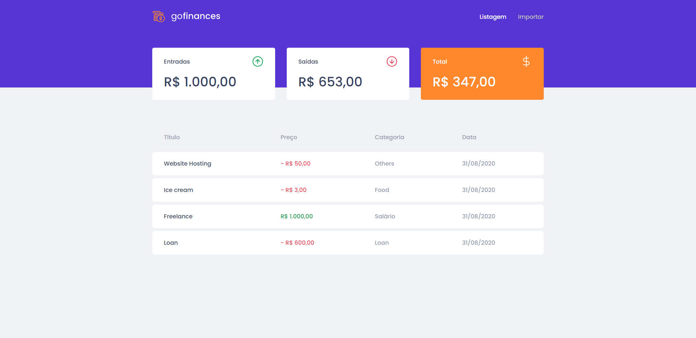

# DESAFIO-06

> Aplicação desenvolvida durante o bootcamp GoStack da Rockeatseat para listar entradas e saídas financeiras

# Backend

## Como rodar | Usage

> **cd backend** && **yarn**
>
> **yarn** typeorm migration:run 
>
> **yarn** dev:server

## Rotas | Routes

| Método | Rota | Tipo | Parâmetros Aceitos |
| ------ | ---- | ---- | ------------------ |
|        |      |      |                    |
|        |      |      |                    |
|        |      |      |                    |
|        |      |      |                    |

## Dependências de Produção | Production dependencies

| Dependência      | Utilização |
| ----------- | ----------- |
| cors    | Serve para habilitar o CORS em nosso servidor e permitir determinadas requisições do backend  |
| express    | Framework para construir aplicações e API's  |
| multer    | Utilizado para o upload de arquivos  |
| pg    | Driver do PostgreSQL  |
| typeorm    | Usado para abstrair queries de banco de dados através de javascript  |

## Dependências de Desenvolvimento | Development dependencies

| Dependência      | Utilização |
| ----------- | ----------- |
| eslint    | Linter para monitoramento do código e indicação de erros  |
| prettier    | Formatador de código, deixando-o padronizado  |
| ts-node-dev    | Permite a inicialização com Typescript, fazendo a conversão dos arquivos .js  |

# Frontend

## Como rodar | Usage

> **cd frontend** && **yarn**
>
> **yarn** start 

## Rotas | Routes

| Rota | Descrição |
| ------ | ---- | 
|        |      | 
|        |      | 

## Dependências de Produção | Production dependencies

| Dependência      | Utilização |
| ----------- | ----------- |
| react    | Biblioteca componentizada e flexível para criação de interfaces  |
| typescript    | Superset da linguagem JavaScript, permite a utilização de tipagem estática  |
| styled-components    | Permite utilização do CSS em JS  |
| polished    | Escure ou clareia tons de cores do CSS com facilidade  |

## Dependências de Desenvolvimento | Development dependencies

| Dependência      | Utilização |
| ----------- | ----------- |
| eslint    | Linter para monitoramento do código e indicação de erros  |
| prettier    | Formatador de código, deixando-o padronizado  |

